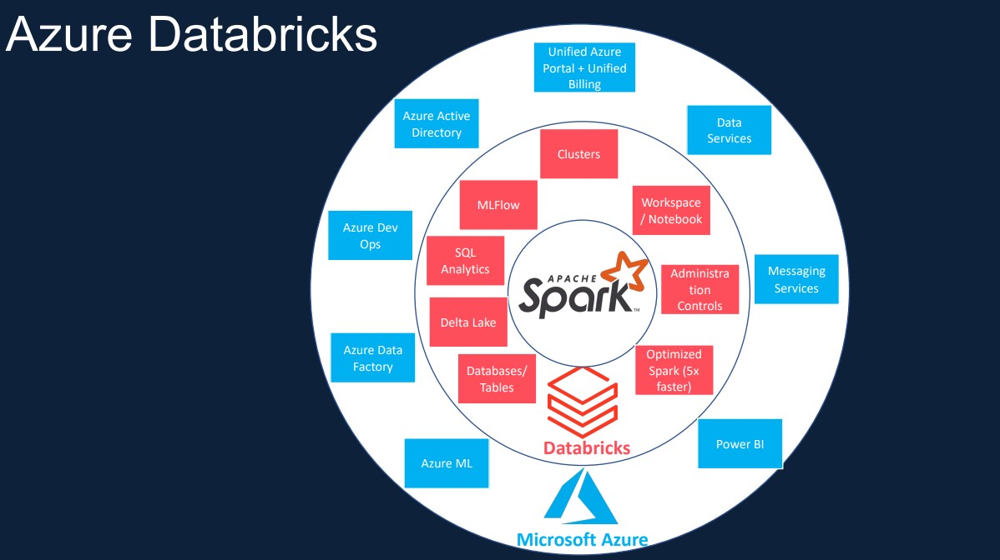
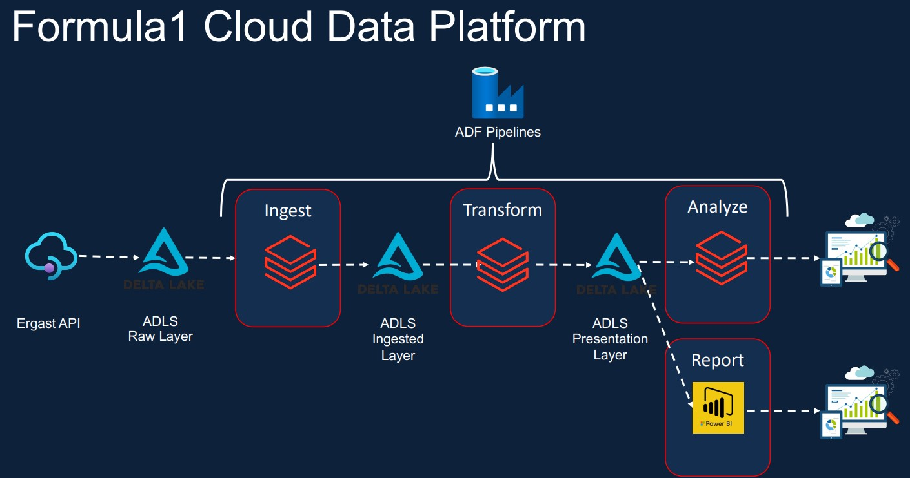
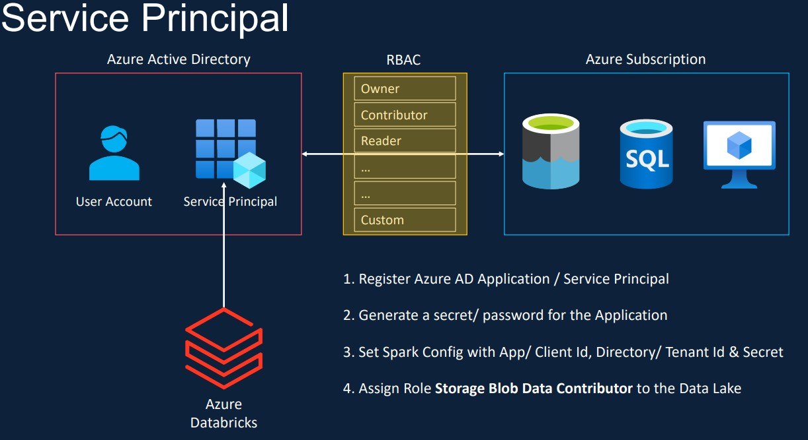
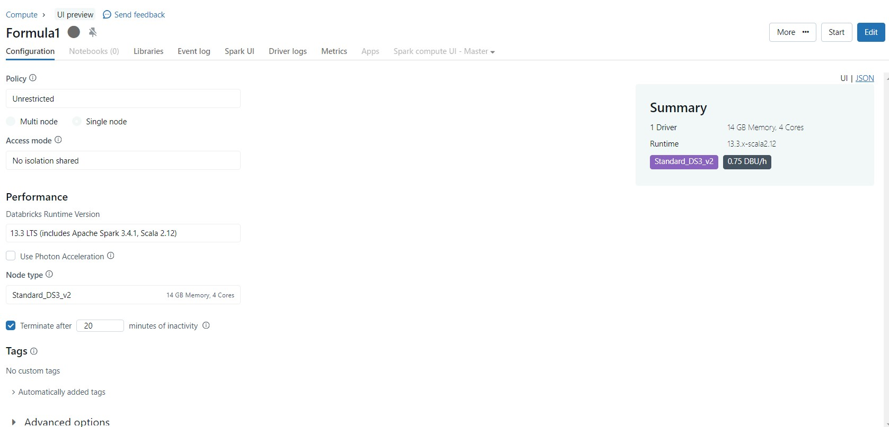
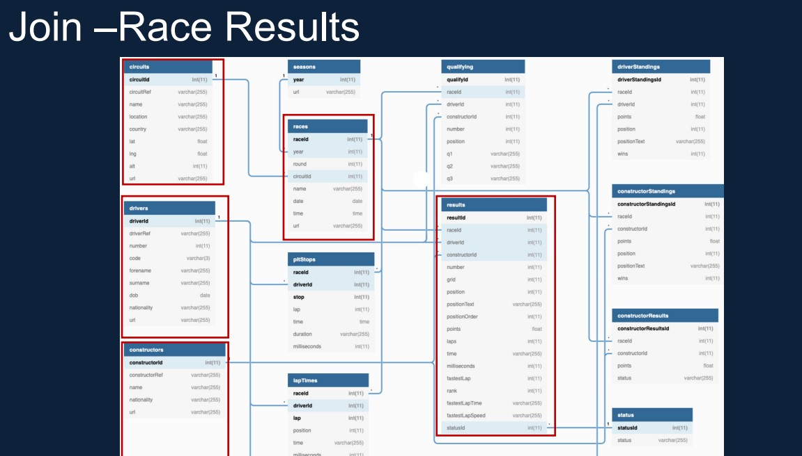
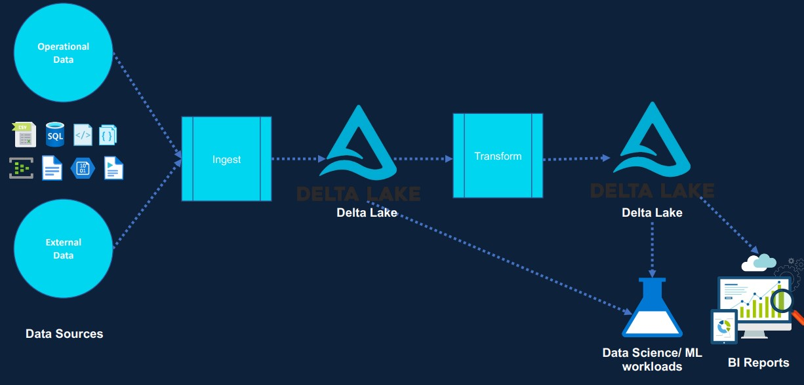

# Formula1 

In this project we will be creating Formula1 Cloud Data Platform to Analysize and report formula1 data across years.

### Key Objectives

1. Dominant Driver in Formula1 race history.
2. Dominant Team in Formula1 race history.

### Tools
Services required for the project.
- Azure Databricks
- Azure Storage Solutions
- Azure Key Vault
- Power BI

### Azure Databricks



### Solution Architecture



### Environment Setup

- Create a Azure acccount using Azure portal.
- Create a resource group to have all services at one place.
- Create and configure Storagee Account(Blob Storage and ADLS GEN2).
- Create and configure Azure Databricks workspace.
- Download and configure Power BI using Azure SQL Database credentials.


- Like always let's divide our project into 3 parts:

  1. Data Ingestion
  2. Data Transformation 
  3. Data Loading and Reporting

### Pre-requisites

- Create bronze, silver, gold contaniers in azure storage account.
- Create a Azure active directory user for databricks and add ``Storage Blob Data Contributor`` role to user.



- Create a cluster in Databricks workspace.


  
## Data Ingestion

- Ergast API is our source in this project, they will provide all the formula1 data in Weekly, Monthly, Yearly frequencies.
- Let's insert all source files in bronze container.
- Let's create mount points for each container using service principle.

``` Refer to Notebooks/set-up and includes folders ```

- Explore the data we have from 1950 to 2021 and understand each file data composition.
- Let's add ingestion date, file type columns and rename all the required columns according to business standands.
- Once everthing is done, ingest this data into silver container in the format of parquet for further transformation.
- Let's create 3 shcemas bronze,silver,gold and create tables for each file.



``` Refer to Notebooks/bronze folder ```

- Join files using their primary keys and create some business value aggeregations on top of it.
- We can use these data and can create visualizations in Databricks environment itself.

- Till now we're processing historical data manually for our analysis using Data lake.
- In real world scenarios, data should be processed real time once and when we receive data in our broze layer.
- We should either process Full dataset everytime or we can go for incremental.
- While processing historical/incremental data, we might recieve some changes in data happend in source end which cannot be replicated in our containers due to schema standards that we set in Data lake.
- If any of our job fails data lake will leave us partials files and We can't perform ACID/DML operations in data lake directly to handle this incorrect data.
- To overcome the above drawbacks of Data lake, Databricks introducted `` DELTA LAKES``.

## Data Transfomation using DELTA LAKE

- Delta lake provides below key advantages over traditional Data lake architecture.



1. Handles all types of data
2. Cheap cloud object storage
3. Uses open source format
4. Support for all types of workloads
5. Ability to use BI tools directly
6. ACID support
7. History & Versioning
8. Better performance
9. Simple architecture
  
- Delta lake storage fomarmat is DELTA but underlying file format will be parquet only.
- Drop all 3 schemas we created and create new ones.
- Create source tables in schemas in Delta format.

`` Refer to Notebooks/ingestion folder path ``

## Data Loading and Reporting 

- Let's now apply required business aggregations on top of source tables and create new tables in GOLD schema for reporting.

`` Refer to Notebooks/Transformation folder path``

- Open PowerBI and connect to Azure Databricks service and import all the tables in ``GOLD`` schema.
- Build report with Dominant Driver and Dominant Team as seperate pages.


